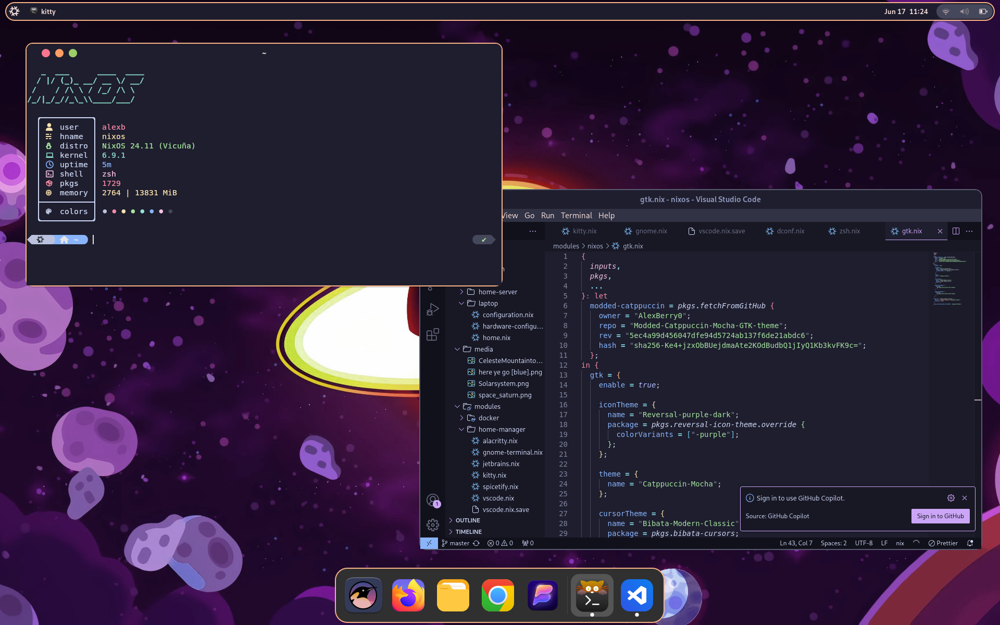

# Welcome to my NixOS dots
## Introduction  
These are my NixOS dotfiles for my systems, I really wouldn't reccommend using them.  
There are two hosts, laptop, and homeserver, these are pretty self descriptive.
In my laptop config there are two desktop enviroments, gnome and hyprland, the gnome config is *mostly* finished while the hyprland config is barely started. 

## Installation
First clone the repo  
```
git clone https://github.com/AlexBerry0/dots.git
```
Then remove all files currently in /etc/nixos/
```
sudo  rm /etc/nixos/*
```
Then move all files from the cloned repository to ```/etc/nixos```  
```
sudo mv dots/* /etc/nixos/
``` 
(optional) Finally deleate the (now) empty folder  
```
sudo rm -r dots
```
Finally rebuild using the chosen host  
```
sudo nixos-rebuild switch --flake /etc/nixos/#HOST-NAME-HERE
```
OR Do it all in one command (MAKE SURE TO REPLACE THE HOSTNAME)    
```
git clone https://github.com/AlexBerry0/dots.git && sudo  rm /etc/nixos/* && sudo mv dots/* /etc/nixos/ && sudo rm -r dots && sudo nixos-rebuild switch --flake /etc/nixos/#HOST-NAME-HERE
```
## Pictures  
### Gnome  

### Hyprland
(Todo)  
### Home-Serer
(Todo)  
## Todo  
### Laptop
- [X] Package GTK theme properly
- [X] Switch to SDDM
- [ ] Change SDDM theme
- [ ] Get jetbrains IDEs setup with plugins
- [ ] Gnome titlebar clock formating
- [ ] Work out gnome keybinds
- [ ] Move to hyprland (long term)
### Home-server
- [ ] Fix ports forwarding
- [ ] Setup OpenVPN
- [ ] Setup media server modules
- [ ] Add monitoring page
- [ ] Get SSL certificates setup
### Other
- [ ] Add pictures to github repo
- [ ] Add other background to media
- [ ] Add propper formating and descriptions to github repo
