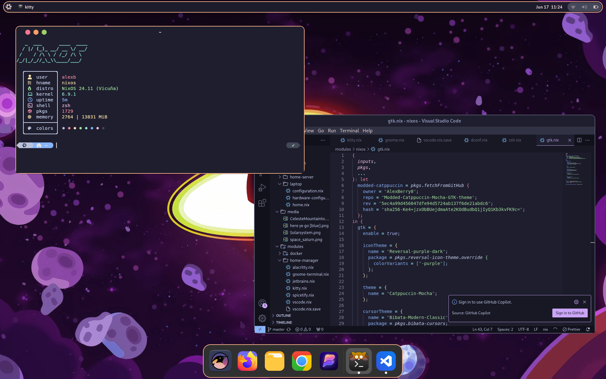
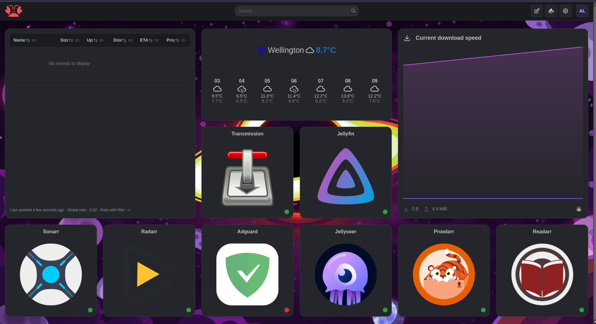

<h1 align="center">
    
   <br>
      My NixOS Dots
   <br>
       <br>
   <div align="center">

   <div align="center">
      <p></p>
      <div align="center">
         <a href="https://github.com/AlexBerry0/dots/">
            
         </a>
         <a = href="https://nixos.org">
            
         </a>
         <a href="https://github.com/AlexBerry0/dots/blob/master/LICENSE">
            
         </a>
      </div>
      <br>
   </div>
</h1>

## Introduction  
These are my NixOS dotfiles for my systems. These are not intended to be a drop in configuration for your computer, but you are welcome to use it as a reference or starting point for your own configuration.
**If you are looking for a more generic NixOS configuration, I recommend [nix-starter-configs](https://github.com/Misterio77/nix-starter-configs).**   
This is all themed using [Catppuccin Mocha](https://catppuccin.com/palette).


## Hosts

|   Hostname  |            Board            |               CPU              |  RAM  |          GPU                | Role | OS  | State |
| :---------: | :-------------------------: | :----------------------------: | :---: | :-------------------------: | :--: | :-: | :---: |
| `laptop`    | Lenovo Yoga 6 13ABR8        | AMD Ryzen 5 7530U              | 16GB  | Radeon Graphics × 12        | 💻️🎭️ | ❄️   | ✅    |
| `home-server`| HP EliteDesk 800 G2 SFF    | INTEL Core i7-6700             | 8GB   | Intel HD Graphics 530       | 🗄️   | ❄️   | ✅    |
| `desktop`   | To Add                      | AMD Ryzen 5 3600               | 16GB  | NVIDIA GTX 1660 SUPER       | 🖥️🎭️ | ❄️   | 🚧    |

**Key**:

- 🎭️ : Dual boot
- 🖥️ : Desktop
- 💻️ : Laptop
- 🗄️ : Server
- ☁️ :  Cloud Server

For more details on the hosts and what apps I use see the sections below:

### Laptop
<details>
<summary>Laptop details</summary>
<h4>Intro</h4>
My laptop is dual booting Windows (for school assessments), & NixOS (for everything else), It's a Lenovo Yoga 6 as described above. It has 512GB of storage split evenly (around about) between the two operating systems.  
It has two desktop environments/WMs, Gnome & Hyprland, I am in the process of switching to Hyprland from Gnome as managing dconf settings using home-manager is terrible. However this is taking a while and is a low priority so it won't happen anytime soon. Below listed are the apps I use.
<h4>Common</h4>

| Type           | Program      |
| :------------- | :----------: |
| Desktop Manager| [SDDM](https://github.com/sddm/sddm) |
| Text editor    | [VSCode](https://code.visualstudio.com/), with declaratively defined extensions |
| Shell          | [ZSH](https://www.zsh.org/) |
| Terminal       | [Kitty](https://github.com/kovidgoyal/kitty) |
| Bootloader     | [Grub](https://www.gnu.org/software/grub/) |
| File Manager   | [Nautilus](https://apps.gnome.org/Nautilus/) |
| GTK Theme      | [My modded Catppuccin Mocha theme](https://github.com/AlexBerry0/Modded-Catppuccin-Mocha-GTK-theme) |
| GTK Icon Theme | [Reversal Purple Dark](https://github.com/yeyushengfan258/Reversal-icon-theme) |
| Terminal Font  | [Hack](https://github.com/source-foundry/Hack) |

<h5>Other notable apps</h5>

| Type           | Program      |
| :------------- | :----------: |
| Messaging      | [Beeper](https://www.beeper.com/) |
| Music          | [Spotify](https://spotify.com) with [Spicetify](https://github.com/the-argus/spicetify-nix) |
| VPN            | [Mullvad](https://mullvad.net/en) |
| OOP development| [IntelliJ Idea](https://www.jetbrains.com/) |
| Media Player   | [Celluloid](https://celluloid-player.github.io/) |


<h4>Gnome</h4>

Obviously using [Gnome](https://www.gnome.org/) as the DE.

<h5>Extensions</h5>

| Name           |
| :------------: |
| user-themes |
| quick-settings-tweaker |
| autohide-battery |
| bluetooth-quick-connect |
| blur-my-shell |
| burn-my-windows |
| compiz-windows-effect |
| coverflow-alt-tab |
| just-perfection |
| logo-menu |
| media-controls |
| no-titlebar-when-maximized |
| notification-banner-reloaded |
| order-gnome-shell-extensions |
| pip-on-top |
| tiling-assistant |
| transparent-window-moving |
| dash-to-dock |
| unite |


<h5>Pictures/Videos</h5>




<h4>Hyprland 🚧</h4>
</details>


### Home server
<details>
<summary>Homer server details</summary>
<h4>Intro</h4>
My home-server is a HP EliteDesk 800 G2 SFF as said above, it's a converted desktop that I got from school, it has 125GBs of storage on the main drive but mounts an external HDD to hold media. The modules running on it can roughly be split into two sections:


<h4>Media</h4>

On the server is an automatic media setup using [Nixarr](https://github.com/rasmus-kirk/nixarr).


<h4>Other Modules</h4>

These other modules are run using [declarative docker containers](https://nixos.wiki/wiki/NixOS_Containers#Declarative_docker_containers).

| Type           | Program      |
| :------------- | :----------: |
| DNS            | [Adguard Home](https://adguard.com/en/adguard-home/overview.html) |
| Dashboard      | [Homarr](https://homarr.dev/) |
| Minecraft Server| [Minecraft server Docker container](https://hub.docker.com/r/itzg/minecraft-server) |

<h5>Pictures/Videos</h5>



</details>

### Desktop 🚧
<details>
<summary>Desktop details </summary>
<h4>Intro</h4>
My Desktop is used mostly for gaming and its config is very smiler to my laptop. It's dualbooting windows, as VR games don't work well enough with linux Nvidia drivers, It's running Gnome as the DE and has mostly the same apps and general configurations.

<h4>Things that are the same as my laptop configuration</h4>


| Type           | Program      |
| :------------- | :----------: |
| Desktop Manager| [SDDM](https://github.com/sddm/sddm) |
| Desktop Environment| [Gnome](https://www.gnome.org/) |
| Text editor    | [VSCode](https://code.visualstudio.com/), with declaratively defined extensions |
| Shell          | [ZSH](https://www.zsh.org/) |
| Terminal       | [Kitty](https://github.com/kovidgoyal/kitty) |
| Bootloader     | [Grub](https://www.gnu.org/software/grub/) |
| File Manager   | [Nautilus](https://apps.gnome.org/Nautilus/) |
| GTK Theme      | [My modded Catppuccin Mocha theme](https://github.com/AlexBerry0/Modded-Catppuccin-Mocha-GTK-theme) |
| GTK Icon Theme | [Reversal Purple Dark](https://github.com/yeyushengfan258/Reversal-icon-theme) |
| Terminal Font  | [Hack](https://github.com/source-foundry/Hack) |
| Messaging      | [Beeper](https://www.beeper.com/) |
| Music          | [Spotify](https://spotify.com) with [Spicetify](https://github.com/the-argus/spicetify-nix) |
| VPN            | [Mullvad](https://mullvad.net/en) |
| OOP development| [IntelliJ Idea](https://www.jetbrains.com/) |
| Media Player   | [Celluloid](https://celluloid-player.github.io/) |

The gnome extensions are also the same:


| Name           |
| :------------: |
| user-themes |
| quick-settings-tweaker |
| autohide-battery |
| bluetooth-quick-connect |
| blur-my-shell |
| burn-my-windows |
| compiz-windows-effect |
| coverflow-alt-tab |
| just-perfection |
| logo-menu |
| media-controls |
| no-titlebar-when-maximized |
| notification-banner-reloaded |
| order-gnome-shell-extensions |
| pip-on-top |
| tiling-assistant |
| transparent-window-moving |
| dash-to-dock |
| unite |

<h4>Things that are different from my laptop configuration</h4>

<h5>Gaming</h5>

Here are a list of apps & services I am using for gaming:


| Name           |
| :------------- |
| [Steam](https://store.steampowered.com/about/)|
| [OBS-studio](https://obsproject.com/)|
| [Prism-launcher](https://prismlauncher.org/)|
| [Minecraft](https://www.minecraft.net/en-us)|
| [Lutris](https://lutris.net/)|
| [Cartridges](https://github.com/kra-mo/cartridges)|
| [steam-run](https://store.steampowered.com/about/)|


 I am also using the proprietary Nvidia drivers.

</details>


## Installation

This install procedure assumes that the user is on a fresh install of NixOS, that they are using bash, and that their hardware-configuration is the same as the hosts dotfiles they will be using. So modify the way you install the dotfiles if this is not the case. If you are dualbooting linux and windows you need to make sure that your /boot partition has more than 250Mb of space, otherwise you will run into issues.


1. First enter a nix shell with git  
```nix-shell -p git```
2. Change the ownership of ```/etc/nixos``` to your user (Optional)  
``` sudo chown -R "USER" /etc/nixos```
3. Remove all files currently in ```/etc/nixos```(You should *probably* save hardware-configuration.nix first)  
```sudo rm -rf /etc/nixos/*```
4. Go into ```/etc/nixos``` and initialize a git repo  
```cd /etc/nixos && git init```
5. Add this repo as a remote origin  
```git remote add origin https://github.com/AlexBerry0/dots.git)```
6. Pull from this origin  
```git pull origin master```
7. Finally rebuild using the chosen host  
```sudo nixos-rebuild switch --flake /etc/nixos/#HOST-NAME-HERE```  
8. Reboot

<details>
<summary>What to do if you manually partitioned the NixOS install and Windows isn't showing up in the boot menu</summary>
<ol>
  <li>Boot into a windows install USB</li>
  <li>Press <kbd>Shift</kbd> + <kbd>F10</kbd> to open a DOS menu</li>
  <li>Run <code>diskpart</code></li>
  <li>Run <code>select Disk=0</code></li>
  <li>Run <code>list partition</code></li>
  <li>Look for the partition that matches the size and type of the /boot partition.</li>
  <li>Run <code>select partition (num partition of `/boot`)</code></li>
  <li>Assign it a letter by running <code>assign letter=""</code>, the letter can be any unused disk letter, I used "Y"</li>
  <li>Exit diskpart</li>
  <li>Now run <code>bcdboot C:/Windows /s "":</code></li>
  <li>Enter <code>diskpart</code> again</li>
  <li>Run <code>list volume</code></li>
  <li>Identify the volume corresponding to the `/boot` partition</li>
  <li>Run <code>select volume (num partition of `/boot`)</code></li>
  <li>Run <code>remove letter=""</code></li>
  <li>reboot</li>
</ol>
</details>

> [!IMPORTANT]  
> If you run into issues with /boot running out of storage space while attempting to rebuild and switch after (This will happen if you used automatic partitioning from the Calamares installer and are trying to dualboot with Windows.) Then you should reinstall NixOS and use manual partitioning to make /boot at least 250Mb. However, if you will not do that then [this guide](https://github.com/NixOS/nixpkgs/issues/23926#issuecomment-940438117) is your best bet for fixing this. You will need to do this every time you update the kernel.  


## Inspiration:

 - [Tobycks's Dots](https://github.com/tobyck/dotfiles)
 - [Sly-Harvey's Config](https://github.com/Sly-Harvey/NixOS)
 - [Wimpy's NixOS & Home Manager Configurations](https://github.com/wimpysworld/nix-config)
