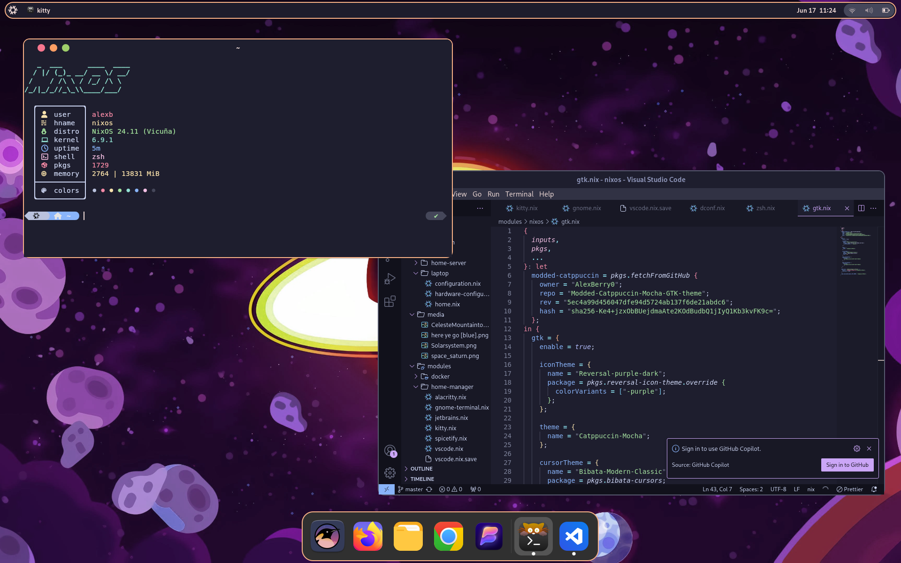

<h1 align="center">
    
   <br>
      My NixOS Dots
   <br>
       <br>
   <div align="center">

   <div align="center">
      <p></p>
      <div align="center">
         <a href="https://github.com/AlexBerry0/dots/">
            
         </a>
         <a = href="https://nixos.org">
            
         </a>
         <a href="https://github.com/AlexBerry0/dots/blob/master/LICENSE">
            
         </a>
      </div>
      <br>
   </div>
</h1>

## Introduction

These are my NixOS dotfiles for my laptop. These are not intended to be a drop in configuration for your computer, but you are welcome to use it as a reference or starting point for your own configuration.

**If you are looking for a more generic NixOS configuration, I recommend [nix-starter-configs](https://github.com/Misterio77/nix-starter-configs).**

This is all themed using [Catppuccin Mocha](https://catppuccin.com/palette).

---

## Repository Structure

```text
.
├── configs/                    # Miscellaneous configuration files
├── media/                      # Images used by the README and configuration
├── modules/                    # Reusable NixOS and Home Manager modules
│   ├── alacritty.nix
│   ├── fish.nix
│   ├── gnome.nix
│   ├── kitty.nix
│   ├── spicetify.nix
│   ├── steam.nix
│   └── vscode.nix
├── pkgs/                       # Custom packages
│   └── beeper-beta.nix
├── configuration.nix           # Main NixOS configuration
├── flake.lock
├── flake.nix                   # Flake entry point
├── hardware-configuration.nix  # Hardware configuration
├── home.nix                    # Home Manager configuration
└── README.md
```

---

## Host

| Hostname | Board | CPU | RAM | GPU | Role | OS | State |
|:--------:|:-----:|:---:|:---:|:---:|:----:|:--:|:-----:|
| `laptop` | Lenovo Yoga 6 13ABR8 | AMD Ryzen 5 7530U | 16GB | Radeon Graphics × 12 | 💻️🎭️ | ❄️ | ✅ |

**Key**

- 🎭️ : Dual boot
- 💻️ : Laptop

For more details on the host and what apps I use see the section below.

### Laptop

<details>
<summary>Laptop details</summary>

#### Intro

My laptop is dual booting Windows (for university assessments) and NixOS (for everything else). It's a Lenovo Yoga 6 as described above with 512GB of storage split roughly evenly between the two operating systems.

Below are the main applications and tools I use.

#### Common

| Type | Program |
|:----|:-------:|
| Desktop Manager | [SDDM](https://github.com/sddm/sddm) |
| Text editor | [VSCode](https://code.visualstudio.com/), with declaratively defined extensions |
| Shell | [Fish](https://fishshell.com/) |
| Shell Prompt | [Starship](https://starship.rs/) |
| Terminal | [Kitty](https://github.com/kovidgoyal/kitty) |
| Bootloader | [Grub](https://www.gnu.org/software/grub/) |
| File Manager | [Nautilus](https://apps.gnome.org/Nautilus/) |
| GTK Theme | [My modded Catppuccin Mocha theme](https://github.com/AlexBerry0/Modded-Catppuccin-Mocha-GTK-theme) |
| GTK Icon Theme | [Reversal Purple Dark](https://github.com/yeyushengfan258/Reversal-icon-theme) |
| Terminal Font | [Hack](https://github.com/source-foundry/Hack) |

#### Other notable apps

| Type | Program |
|:----|:-------:|
| Messaging | [Beeper](https://www.beeper.com/) |
| Music | [Spotify](https://spotify.com) with [Spicetify](https://github.com/the-argus/spicetify-nix) |
| VPN | [Mullvad](https://mullvad.net/en) |
| OOP development | [IntelliJ IDEA](https://www.jetbrains.com/) |
| Media Player | [Celluloid](https://celluloid-player.github.io/) |

#### Gnome

Using [GNOME](https://www.gnome.org/) as the desktop environment.

##### Extensions


|             Name             |
|:----------------------------:|
|         user-themes          |
|    quick-settings-tweaker    |
|       autohide-battery       |
|   bluetooth-quick-connect    |
|        blur-my-shell         |
|       burn-my-windows        |
|    compiz-windows-effect     |
|      coverflow-alt-tab       |
|       just-perfection        |
|          logo-menu           |
|        media-controls        |
|  no-titlebar-when-maximized  |
| notification-banner-reloaded |
| order-gnome-shell-extensions |
|          pip-on-top          |
|       tiling-assistant       |
|  transparent-window-moving   |
|         dash-to-dock         |
|            unite             |


##### Screenshot



</details>

---

## Installation

<details>


This install procedure assumes that you are on a fresh install of NixOS, are using Bash, and that your hardware-configuration matches this laptop configuration. If you are dual booting Linux and Windows, make sure your `/boot` partition has at least 250 MB available.

1. Enter a nix shell with Git

```bash
nix-shell -p git
```

2. (Optional) Change the ownership of `/etc/nixos`

```bash
sudo chown -R USER /etc/nixos
```

3. Remove the existing configuration

```bash
sudo rm -rf /etc/nixos/*
```

4. Initialise a Git repository

```bash
cd /etc/nixos
git init
```

5. Add this repository

```bash
git remote add origin https://github.com/AlexBerry0/dots.git
```

6. Pull the configuration

```bash
git pull origin master
```

7. Rebuild

```bash
sudo nixos-rebuild switch --flake /etc/nixos#laptop
```

8. Reboot
</details>


---

## Inspiration

- TobyCK's Dots
- Sly-Harvey's Config
- Wimpy's NixOS & Home Manager Configurations
- Veraticus's Config